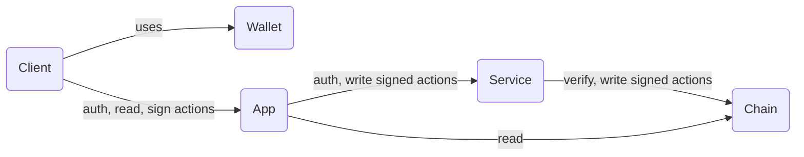

# diplomac.eth

- [x] Basic App and Service with SIWE https://github.com/spruceid/siwe-quickstart/tree/main/03_complete_app
- [ ] Sign a simple EIP-712 message, stored by the Service
- [ ] Define interface of game data
- [ ] Implement mock of game data retrieval
- [ ] Create smart contract
- [ ] ...
